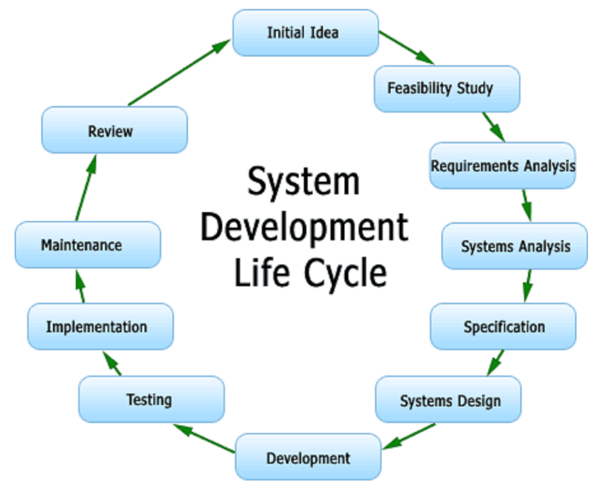

system-design-interview

## 自述文件

> 如何为IT公司准备系统设计问题

系统设计是一个非常广泛的主题。即使是在顶级IT公司具有多年工作经验的软件工程师，也可能不是系统设计专家。如果您想成为专家，则需要阅读许多书籍，文章，并解决真正的大规模系统设计问题。

该存储库仅教您如何在短时间内以系统的方式处理系统设计面试。如果有时间，您可以深入研究每个主题。当然，欢迎您添加您的想法！

## 目录

-  [系统设计面试技巧](https://github.com/checkcheckzz/system-design-interview#tips)
-  [系统设计基础知识](https://github.com/checkcheckzz/system-design-interview#intro)
-  [公司工程博客](https://github.com/checkcheckzz/system-design-interview#blog)
-  [产品与系统](https://github.com/checkcheckzz/system-design-interview#system)
-  [热门问题和参考](https://github.com/checkcheckzz/system-design-interview#qs)
-  [好书](https://github.com/checkcheckzz/system-design-interview#bk)
-  [面向对象设计](https://github.com/checkcheckzz/system-design-interview#ood)

### [[⬆\]](https://github.com/checkcheckzz/system-design-interview#toc) 系统设计面试技巧：

**明确约束条件并确定用户案例**

花几分钟询问面试官并就系统范围达成共识。记住要确保您知道面试官一开始没有告诉您的所有要求。

用户案例表明了系统的主要功能，并且约束条件列出了系统的规模，例如每秒的请求数，请求类型，每秒写入的数据，每秒读取的数据。

**高级架构设计**

画出重要的组件及其之间的连接，但不要赘述。通常，可伸缩系统包括Web服务器（负载均衡器），服务（服务分区），数据库（主数据库/辅助数据库群集插件缓存）。

**元件设计**

对于每个组件，您需要为每个组件编写特定的API。您可能需要完成特定功能的详细OOD设计。您可能还需要设计数据库的数据库架构。

### [[⬆\]](https://github.com/checkcheckzz/system-design-interview#toc) 有关系统设计的基本知识：

这是有关系统设计相关主题的一些文章。

- [如何进行系统设计面试](http://www.palantir.com/2011/10/how-to-rock-a-systems-design-interview/)
- [系统面试](http://www.hiredintech.com/app#system-design)
- [假人的可伸缩性](http://www.lecloud.net/tagged/scalability)
- [可扩展的Web体系结构和分布式系统](http://www.aosabook.org/en/distsys.html)
- [每个人都应该知道的数字](http://everythingisdata.wordpress.com/2009/10/17/numbers-everyone-should-know/)
- [分布式系统的谬误](https://pages.cs.wisc.edu/~zuyu/files/fallacies.pdf)
- [可扩展的系统设计模式](http://horicky.blogspot.com/2010/10/scalable-system-design-patterns.html)
- [规模设计系统简介](http://lethain.com/introduction-to-architecting-systems-for-scale/)
- [跨数据中心的事务](http://snarfed.org/transactions_across_datacenters_io.html)
- [CAP定理的简单英语介绍](http://ksat.me/a-plain-english-introduction-to-cap-theorem/)
- [CAP常见问题](https://github.com/henryr/cap-faq)
- [Paxos变得简单](http://research.microsoft.com/en-us/um/people/lamport/pubs/paxos-simple.pdf)
- [一致的散列](http://www.tom-e-white.com/2007/11/consistent-hashing.html)
- [NOSQL模式](http://horicky.blogspot.com/2009/11/nosql-patterns.html)
- [可伸缩性，可用性和稳定性模式](http://www.slideshare.net/jboner/scalability-availability-stability-patterns)

当然，如果您想深入研究与系统相关的主题，这里有很多有关[服务工程](https://github.com/mmcgrana/services-engineering)的阅读清单，也有很多有关[分布式系统的资料](http://dancres.github.io/Pages/)。

### [[⬆\]](https://github.com/checkcheckzz/system-design-interview#toc) 公司工程博客：

如果您要在一家公司上门服务，则应阅读他们的工程博客。

- [高扩展性](http://highscalability.com/)
- [GitHub博客](https://github.com/blog/category/engineering)
- [Quora的工程学](http://engineering.quora.com/)
- [Yelp工程博客](http://engineeringblog.yelp.com/)
- [Twitter工程](https://engineering.twitter.com/)
- [Facebook工程](https://www.facebook.com/Engineering)
- [Yammer工程](http://eng.yammer.com/blog/)
- [Etsy Code as Craft](http://codeascraft.com/)
- [Foursquare工程博客](http://engineering.foursquare.com/)
- [Airbnb工程](http://nerds.airbnb.com/)
- [Web工程工程博客](http://engineering.webengage.com/)
- [领英工程](http://engineering.linkedin.com/blog)
- [Netflix技术博客](http://techblog.netflix.com/)
- [BankSimple简单博客](https://www.simple.com/engineering/)
- [广场角](http://corner.squareup.com/)
- [SoundCloud后台博客](https://developers.soundcloud.com/blog/)
- [Flickr代码](http://code.flickr.net/)
- [Instagram工程](http://instagram-engineering.tumblr.com/)
- [Dropbox技术博客](https://tech.dropbox.com/)
- [Cloudera开发人员博客](http://blog.cloudera.com/)
- [Bandcamp科技](http://bandcamptech.wordpress.com/)
- [牡蛎技术博客](http://tech.oyster.com/)
- [REDDIT博客](http://www.redditblog.com/)
- [Groupon工程博客](https://engineering.groupon.com/)
- [Songkick技术博客](http://devblog.songkick.com/)
- [Google研究博客](http://googleresearch.blogspot.com/)
- [Pinterest工程博客](http://engineering.pinterest.com/)
- [Twilio工程博客](http://www.twilio.com/engineering)
- [比特工程博客](http://word.bitly.com/)
- [优步工程博客](https://eng.uber.com/)
- [戈达迪工程](http://engineering.godaddy.com/)
- [Splunk博客](http://blogs.splunk.com/)
- [Coursera工程博客](https://building.coursera.org/)
- [贝宝工程博客](https://www.paypal-engineering.com/)
- [隔壁工程博客](https://engblog.nextdoor.com/)
- [Booking.com开发博客](https://blog.booking.com/)
- [Scalyr工程博客](https://blog.scalyr.com/)

### [[⬆\]](https://github.com/checkcheckzz/system-design-interview#toc) 产品和系统：

以下论文/文章/幻灯片可帮助您了解不同实际产品和系统的一般设计思想。

- [MapReduce：大型集群上的简化数据处理](http://static.googleusercontent.com/media/research.google.com/zh-CN/us/archive/mapreduce-osdi04.pdf)
- [Bigtable：用于结构化数据的分布式存储系统](http://www.read.seas.harvard.edu/~kohler/class/cs239-w08/chang06bigtable.pdf)
- [Google文件系统](http://static.googleusercontent.com/media/research.google.com/zh-CN/us/archive/gfs-sosp2003.pdf)
- [松耦合分布式系统的Chubby Lock服务](http://static.googleusercontent.com/external_content/untrusted_dlcp/research.google.com/en/us/archive/chubby-osdi06.pdf)
- [Dynamo：亚马逊的高可用键值存储](http://www.read.seas.harvard.edu/~kohler/class/cs239-w08/decandia07dynamo.pdf)
- [Memcached简介](http://www.slideshare.net/oemebamo/introduction-to-memcached)
- [Cassandra简介功能](http://www.slideshare.net/planetcassandra/cassandra-introduction-features-30103666)
- [HBase简介](http://www.slideshare.net/alexbaranau/intro-to-hbase)
- [MongoDB简介](http://www.slideshare.net/mdirolf/introduction-to-mongodb)
- [Redis简介](http://www.slideshare.net/dvirsky/introduction-to-redis)
- [风暴](http://www.slideshare.net/previa/storm-16094009)
- [Zookeeper简介](http://www.slideshare.net/sauravhaloi/introduction-to-apache-zookeeper)
- [卡夫卡](http://www.slideshare.net/mumrah/kafka-talk-tri-hug)
- [YouTube架构](http://highscalability.com/youtube-architecture)
- [缩放Pinterest](http://highscalability.com/blog/2013/4/15/scaling-pinterest-from-0-to-10s-of-billions-of-page-views-a.html)
- [Google建筑](http://highscalability.com/google-architecture)
- [扩展Twitter](http://highscalability.com/scaling-twitter-making-twitter-10000-percent-faster)
- [WhatsApp架构](http://highscalability.com/blog/2014/2/26/the-whatsapp-architecture-facebook-bought-for-19-billion.html)
- [Flickr架构](http://highscalability.com/flickr-architecture)
- [亚马逊架构](http://highscalability.com/amazon-architecture)
- [堆栈溢出架构](http://highscalability.com/blog/2009/8/5/stack-overflow-architecture.html)
- [Pinterest建筑](http://highscalability.com/blog/2012/5/21/pinterest-architecture-update-18-million-visitors-10x-growth.html)
- [Tumblr架构](http://highscalability.com/blog/2012/2/13/tumblr-architecture-15-billion-page-views-a-month-and-harder.html)
- [Instagram架构](http://highscalability.com/blog/2011/12/6/instagram-architecture-14-million-users-terabytes-of-photos.html)
- [TripAdvisor建筑](http://highscalability.com/blog/2011/6/27/tripadvisor-architecture-40m-visitors-200m-dynamic-page-view.html)
- [缩放邮箱](http://highscalability.com/blog/2013/6/18/scaling-mailbox-from-0-to-one-million-users-in-6-weeks-and-1.html)
- [Salesforce架构](http://highscalability.com/blog/2013/9/23/salesforce-architecture-how-they-handle-13-billion-transacti.html)
- [ESPN架构](http://highscalability.com/blog/2013/11/4/espns-architecture-at-scale-operating-at-100000-duh-nuh-nuhs.html)
- [优步架构](http://highscalability.com/blog/2015/9/14/how-uber-scales-their-real-time-market-platform.html)
- [DropBox设计](https://www.youtube.com/watch?v=PE4gwstWhmc)
- [Splunk架构](http://www.splunk.com/view/SP-CAAABF9)

### [[⬆\]](https://github.com/checkcheckzz/system-design-interview#toc) 热点问题和参考：

每个问题都有一些很好的参考。这里的参考是幻灯片和文章。

**设计CDN网络**
参考：

- [全球分布的内容交付](http://repository.cmu.edu/cgi/viewcontent.cgi?article=2112&context=compsci)

**设计Google文档系统**
参考：

- [google-mobwrite](https://code.google.com/p/google-mobwrite/)
- [差分同步](https://neil.fraser.name/writing/sync/)

**设计随机ID生成系统**
参考：

- [宣布雪花](https://blog.twitter.com/2010/announcing-snowflake)
- [雪花](https://github.com/twitter/snowflake/)

**设计键值数据库**
参考：

- [Redis简介](http://www.slideshare.net/dvirsky/introduction-to-redis)

**设计Facebook新闻订阅功能**
参考：

- [建立类似新闻提要的最佳实践是什么？](http://www.quora.com/What-are-best-practices-for-building-something-like-a-News-Feed)
- [开发社交网络供稿时要注意哪些扩展问题？](http://www.quora.com/Activity-Streams/What-are-the-scaling-issues-to-keep-in-mind-while-developing-a-social-network-feed)
- [活动提要架构](http://www.slideshare.net/danmckinley/etsy-activity-feeds-architecture)

**设计Facebook时间轴功能**
参考：

- [建筑时间表](https://www.facebook.com/note.php?note_id=10150468255628920)
- [Facebook的时间表](http://highscalability.com/blog/2012/1/23/facebook-timeline-brought-to-you-by-the-power-of-denormaliza.html)

**设计一个函数以在过去的时间间隔内返回前k个请求**
参考：

- [数据流中频繁和Top-k元素的高效计算](http://www.cse.ust.hk/~raywong/comp5331/References/EfficientComputationOfFrequentAndTop-kElementsInDataStreams.pdf)
- [在流Windows中监视前k个查询的最佳策略](http://davis.wpi.edu/xmdv/docs/EDBT11-diyang.pdf)

**设计在线多人纸牌游戏**
参考：

- [如何创建异步多人游戏](http://www.indieflashblog.com/how-to-create-an-asynchronous-multiplayer-game.html)
- [如何创建异步多人游戏第2部分：将游戏状态保存到在线数据库](http://www.indieflashblog.com/how-to-create-async-part2.html)
- [如何创建异步多人游戏第3部分：从数据库加载游戏](http://www.indieflashblog.com/how-to-create-async-part3.html)
- [如何创建异步多人游戏第4部分：对接会](http://www.indieflashblog.com/how-to-create-async-part4-html.html#comment-4447)
- [HTML5中的实时多人游戏](http://buildnewgames.com/real-time-multiplayer/)

**设计图搜索功能**
参考：

- [建立图搜索的基础架构](https://www.facebook.com/notes/facebook-engineering/under-the-hood-building-out-the-infrastructure-for-graph-search/10151347573598920)
- [图表搜索中的索引编制和排名](https://www.facebook.com/notes/facebook-engineering/under-the-hood-indexing-and-ranking-in-graph-search/10151361720763920)
- [Facebook上](http://www.erlang-factory.com/upload/presentations/31/EugeneLetuchy-ErlangatFacebook.pdf)[Graph Search](https://www.facebook.com/notes/facebook-engineering/under-the-hood-the-natural-language-interface-of-graph-search/10151432733048920)和[Erlang](http://www.erlang-factory.com/upload/presentations/31/EugeneLetuchy-ErlangatFacebook.pdf)[的自然语言界面](https://www.facebook.com/notes/facebook-engineering/under-the-hood-the-natural-language-interface-of-graph-search/10151432733048920)

**设计图片共享系统**
参考：

- [Flickr架构](http://highscalability.com/flickr-architecture)
- [Instagram架构](http://highscalability.com/blog/2011/12/6/instagram-architecture-14-million-users-terabytes-of-photos.html)

**设计搜索引擎**
参考：

- [您将如何实施Google搜索？](http://programmers.stackexchange.com/questions/38324/interview-question-how-would-you-implement-google-search)
- [实施搜索引擎](http://www.ardendertat.com/2012/01/11/implementing-search-engines/)

**设计推荐系统**
参考：

- [Hulu的推荐系统](http://tech.hulu.com/blog/2011/09/19/recommendation-system.html)
- [推荐系统](http://ijcai13.org/files/tutorial_slides/td3.pdf)

**设计tinyurl系统**
参考：

- [大数据tinyurl的系统设计](http://n00tc0d3r.blogspot.com/)
- [URL Shortener API](https://developers.google.com/url-shortener/?csw=1)

**设计垃圾收集系统**
参考：

- [婴儿的第一个垃圾收集器](http://journal.stuffwithstuff.com/2013/12/08/babys-first-garbage-collector/)

**设计可伸缩的Web爬网系统**
参考：

- [如何从头开始构建网络搜寻器？](https://www.quora.com/How-can-I-build-a-web-crawler-from-scratch)

**设计Facebook聊天功能**
参考：

- [Facebook上的Erlang](http://www.erlang-factory.com/upload/presentations/31/EugeneLetuchy-ErlangatFacebook.pdf)
- [脸书聊天](https://www.facebook.com/note.php?note_id=14218138919&id=9445547199&index=0)

**设计趋势主题系统**
参考：

- [在风暴中使用分布式滚动计数算法实现实时趋势主题](http://www.michael-noll.com/blog/2013/01/18/implementing-real-time-trending-topics-in-storm/)
- [尽早发现Twitter趋势的原因](http://snikolov.wordpress.com/2012/11/14/early-detection-of-twitter-trends/)

**设计缓存系统**
参考：

- [Memcached简介](http://www.slideshare.net/oemebamo/introduction-to-memcached)

### [[⬆\]](https://github.com/checkcheckzz/system-design-interview#toc) 好书：

- [大数据：可伸缩实时数据系统的原理和最佳实践](http://www.amazon.com/Big-Data-Principles-practices-scalable/dp/1617290343)
- [实时分析：分析和可视化流数据的技术](http://www.amazon.com/Real-Time-Analytics-Techniques-Visualize-Streaming/dp/1118837916)
- [构建微服务：设计细粒度的系统](http://www.amazon.com/Building-Microservices-Sam-Newman/dp/1491950358)
- [设计数据密集型应用程序：可靠，可扩展和可维护系统背后的大创意](https://www.amazon.com/Designing-Data-Intensive-Applications-Reliable-Maintainable/dp/1449373321)

### [[⬆\]](https://github.com/checkcheckzz/system-design-interview#toc) 面向对象的设计：

#### OOD面试技巧

**弄清场景，写出用例**

用例是对事件序列的描述，这些事件一起导致系统做一些有用的事情。谁将使用它，以及他们将如何使用它。该系统可能非常简单或非常复杂。

特殊的系统要求，例如多线程，面向读取或写入。

**定义对象**

将标识映射到类：一个类对应一个类，此方案中的每个核心对象对应一个类。

考虑类之间的关系：某些类必须具有唯一的实例，一个对象具有许多其他对象（组成），一个对象是另一对象（继承）。

确定每个类的属性：将名词更改为变量，将操作更改为方法。

使用设计模式，以便可以在多个应用程序中重用它。

#### 有用的网站

- [101种开发人员的设计模式和技巧](http://sourcemaking.com/design-patterns-and-tips)